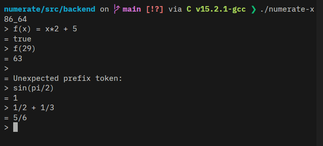

# Numerate

Numerate is a natural language calculator for converting between units or using variable based calculations.

## About

This project was originally supposed to be something like Soulver or wolfram alpha. However, due to time constraints, It currently is a terminal application and has support for functions, unit conversions variables and some mathematical operations.

## Installing

### Prebuilt binaries
Download the linux executable from  [releases](https://github.com/0xurandom/numerate/releases).

Make it executable and run:
```sh
chmod +x ./numerate-x86_64 && ./numerate-x86_64
```

### Compile from source

#### Dependencies
- GMP
- MPFR
- MPC
- libm


For fedora:
```sh
sudo dnf install gcc gmp-devel mpfr-devel libmpc-devel
```


Clone the repo:
```sh
git clone https://github.com/0xurandom/numerate.git && cd numerate/
```

Compile with make:
```sh
cd src/backend/ && make;
```

Run the binary
```sh
./numerate-x86_64
```

## Usage

A function can be defined and called as:
```
> f(x) = x*2
= true

> f(2)
= 4
```

Units can be converted as:
```
> 25 km to mile
= 15.5156
```

Only singular units are supported i.e. mile not miles.

Variables can be defined as:
```
> x = 29
= 29
```

Some predefined variables are `pi`, `tau` and `phi`.


